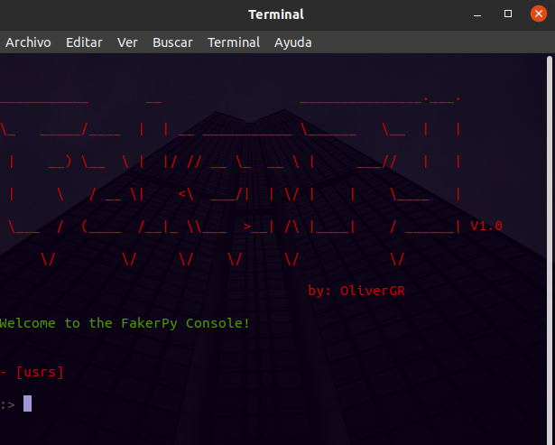
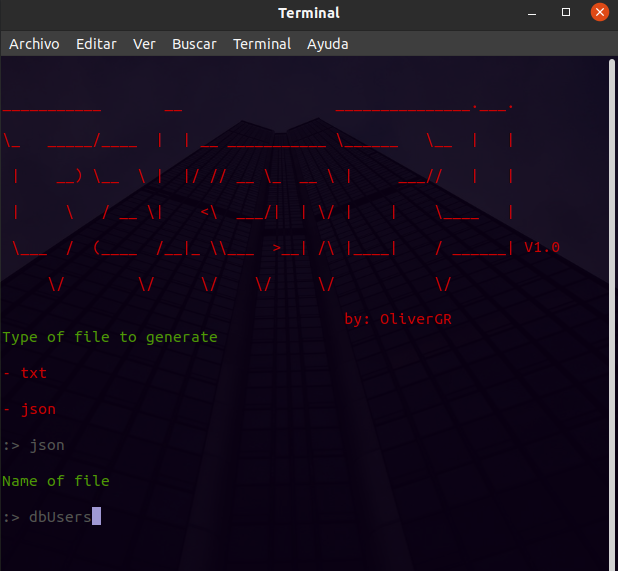

# Generador de datos falsos con Python y Faker  

<div style="display: flex; justify-content: space-around; align-items: center; flex-wrap:wrap; gap: 40px; margin: 30px 0;">
    
    
</div>

# ¿Qué hace?  
Genera cantidad de datos falsos y los guarda como archivo segun sea el tipo.  
Por el momento solo hay:  
- Lista de usuarios  
- Generador de contraseñas  
- Generador de correos electrónicos  

Una vez escogido el tipo de dato que se quiere generar, se puede  
crear una cantidad de datos que prefiera. Para seguido de esto  
se puedan guardar en un archivo de texto o en un JSON.  

## Instalaciones
- [Python]('https://www.python.org/downloads/')  

- faker: pip install faker  

## Adicionales  
Este proyecto fue creado con la versión 3.9.7 de python.  
Si desea instalar [conda](https://docs.conda.io/projects/conda/en/latest/user-guide/install/index.html) puede hacerlo para crear un entorno con la versión 3.9.7  
y pueda trabajar con este proyecto sin problemas.

## Para iniciar

```bash
    $ python index.py
```

# Uso  
  
La lista de los posibles datos a generar estara disponible dentro  
de los corchetes, y este será el nombre con el cual se accederá al  
generador.  


  
  
Se escoge lo que se quiere generar para despues asignar cantidad y   
si se desea guardar en un tipo de archivo.  

  
Se escoge el tipo de archivo que se desea guardar y seguido de esto  
se agrega el nombre del fichero que se va crear.  

**SALIDA**  
  

# Modelo de los datos  
```python  
from faker import Faker

fake = Faker()


def modelUser():
    name = fake.name()
    last_name = fake.last_name()

    return {
        "id": fake.uuid4(),
        "name": name,
        "lastName": last_name,
        "email": f"{name}.{last_name}@{fake.domain_name()}".replace(" ", ""),
        "password": fake.password(),
    }
```  
El modelo Usuario es un diccionario con los siguientes campos:
- id
- name
- lastName
- email
- password  

Cada uno es generado con ayuda de faker, sí quieres agregar mas campos o  
editar alguno, puedes hacerlo en este modelo.  

Al final esto se esta importando en la clase User y se generan segun  
la cantidad de datos que se desee.

```python

from models.userModel import modelUser

def generateFastUser(self):
        print("How many users do you want to generate?")
        amount = int(input(":> "))

        for user in range(amount):
            self.users.append(modelUser())

        print(json.dumps(self.users, sort_keys=False, indent=4))
        self.questSaveInFile(self.users)
        self.users.clear()


```